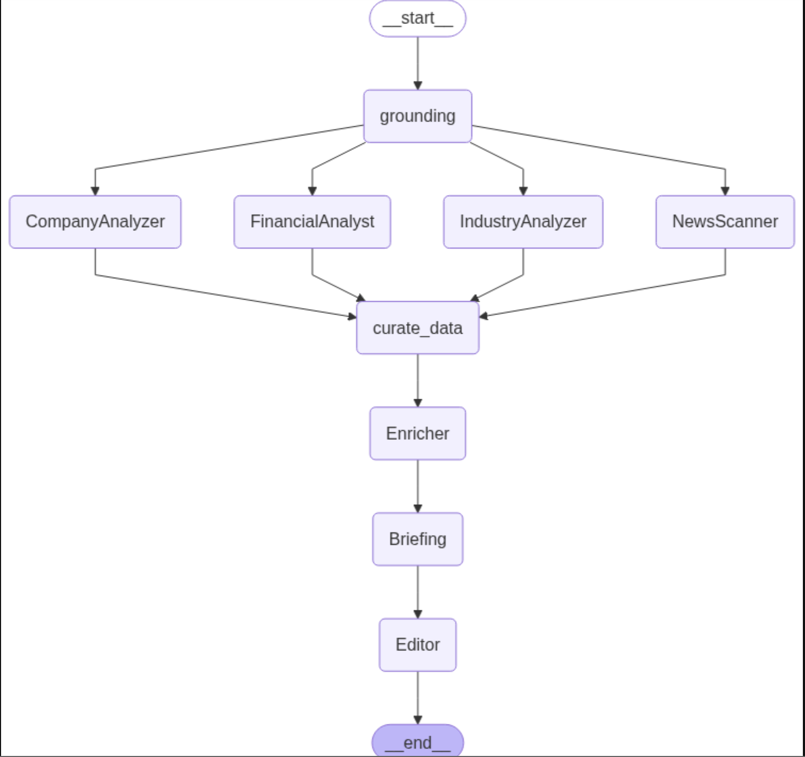

# Company Research Agent 



## 🧠 Project Overview

**Company Research Agent** is an intelligent system designed to automate the task of researching companies by:

* Scraping and analyzing company websites.
* Summarizing industry, financial, and news data.
* Generating concise briefings using LLMs.
* Producing structured reports from gathered insights.

This system is ideal for investment analysts, competitive researchers, or anyone needing summarized insights about a company with minimal manual effort.

---

## ⚙️ Tech Stack

* **LangChain** (LLM orchestration)
* **OpenAI** (ChatGPT API for summarization and reasoning)
* **Tavily API** (Web scraping & content extraction)
* **LangSmith** (Tracing and observability)
* **Python** & **Jupyter Notebook**
* **dotenv** for environment variable management

---

## 📁 Project Structure

The system is modular, and the code is logically divided into:

1. **Utilities**: Helpers for cleaning titles, extracting domain names, etc.
2. **State Management**: Uses `TypedDict` to maintain structured agent state.
3. **Tooling**: Defines tools like website scraping using Tavily.
4. **Agent Nodes**: Contains logic nodes for gathering, summarizing, and organizing information.
5. **Graph Definition**: Uses LangGraph to connect nodes in a meaningful execution flow.
6. **Execution**: Final stage where the graph is invoked with inputs.

---

## 🧩 Components

### 1. Environment Setup

Loads API keys and enables tracing:

```python
os.environ["LANGSMITH_TRACING"] = "true"
os.environ["OPENAI_API_KEY"] = os.getenv("OPENAI_API_KEY")
```

### 2. Helper Functions

Includes utility functions such as:

* `clean_title(title: str)` — sanitizes page titles.
* `extract_domain_name(url: str)` — derives readable names from URLs.
* `extract_title_from_url_path(url: str)` — generates a fallback title from URL path.

### 3. State Management

Defines a custom `ResearchState` using `TypedDict` to maintain state between graph steps, including:

```python
company, company_url, industry
site_scrape, financial_data, news_data
company_briefing, report, messages, references
```

### 4. Scraping Tool (Tavily)

Defines a tool node that uses the **Tavily API** to extract web content:

```python
extraction = tavily_client.extract(url, extract_depth="basic")
```

Extracted results are stored under `site_scrape`.

### 5. Summarization with OpenAI

Uses `ChatOpenAI` from LangChain to summarize each category (e.g., financial, company, industry, news) into concise briefings based on context.

### 6. LangGraph Execution

The project defines a graph using LangGraph where:

* Nodes = agents/tools
* Edges = execution paths
* The graph flows through:
  `query -> scraping -> summarizing -> final report generation`

---

## 🚀 How It Works

1. **Input**: Provide company name and URL.
2. **Scraping**: Tavily scrapes and extracts structured web content.
3. **Summarization**: LLM processes scraped data and generates briefings.
4. **State Update**: All interim results are stored in the state.
5. **Report Generation**: Final report is assembled using all components.

---

## 🧪 Example Use Case

```python
input = {
    "company": "Tavily",
    "company_url": "https://www.tavily.com",
    "industry": "AI Tools"
}

result = graph.invoke(input)
print(result['report'])
```

---

## 📌 Key Highlights

* Modular and extensible design — can add more data sources easily.
* Tracks and stores intermediate reasoning steps (via LangSmith).
* Clean, explainable briefings from raw web pages.
